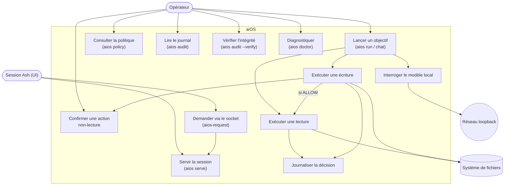
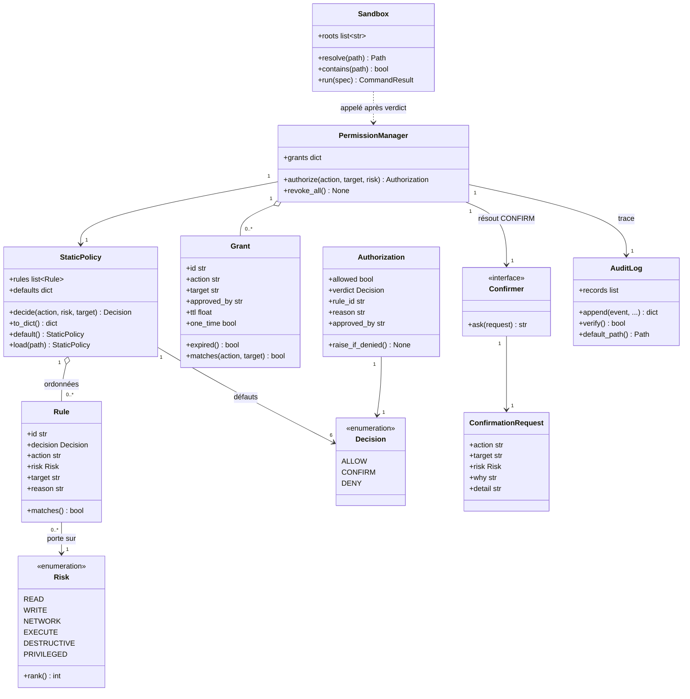
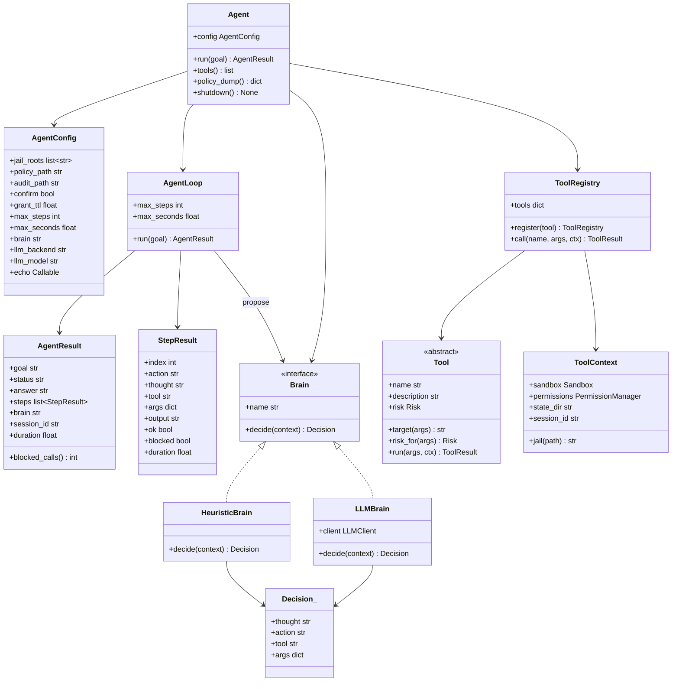
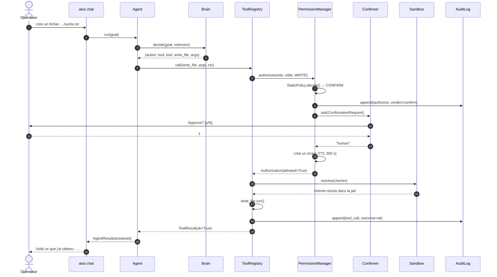
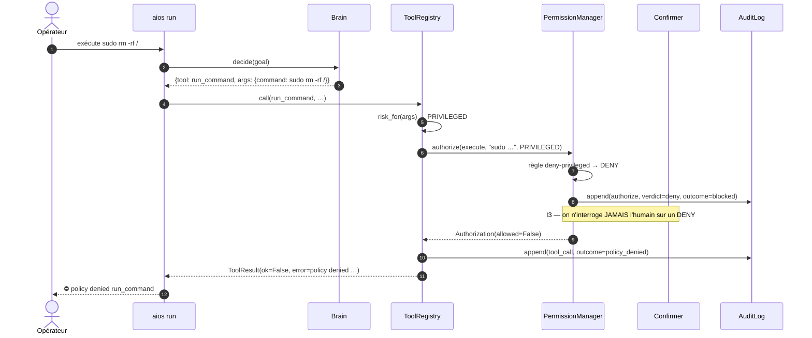
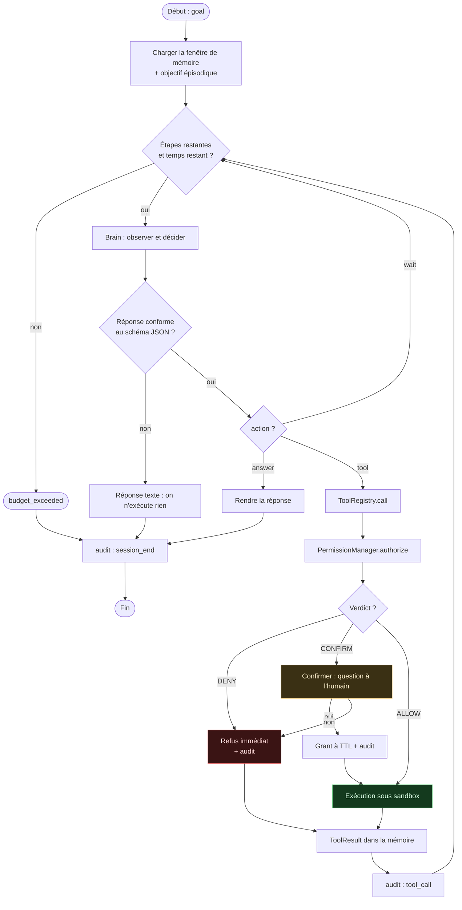
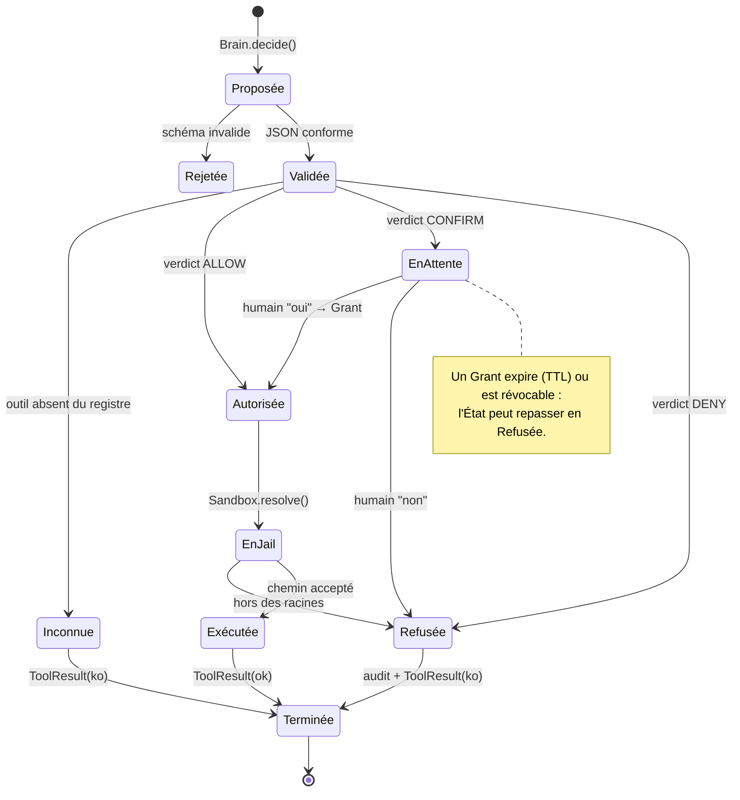
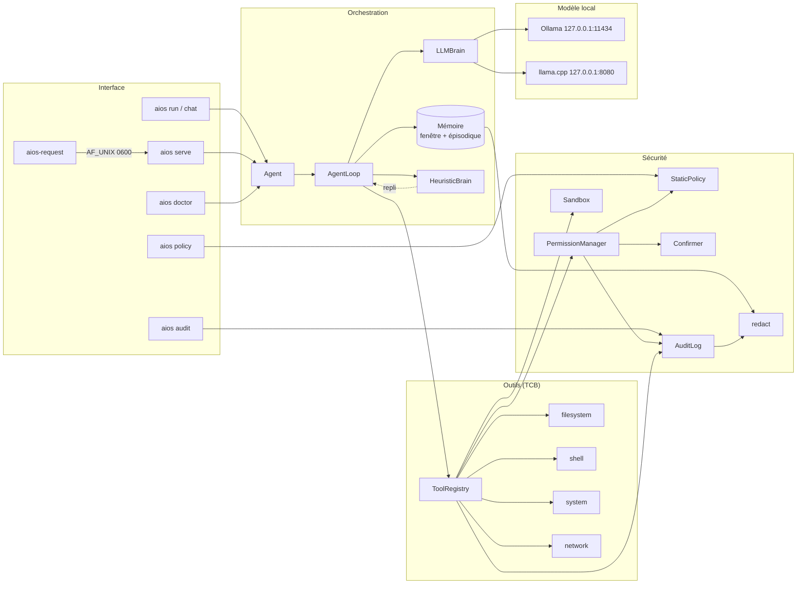
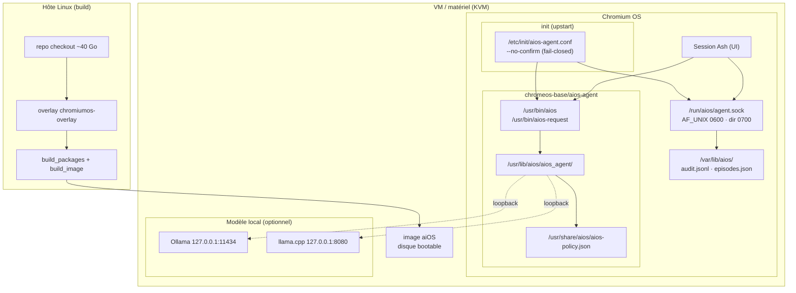
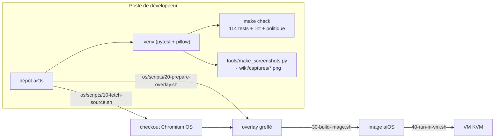

# Diagrammes UML

Tous les diagrammes sont en **Mermaid** : ils sont rendus par le wiki et restent
modifiables dans le dépôt. Les captures d'écran du terminal sont dans
[Documentation fonctionnelle](Documentation-fonctionnelle).

---

## 1. Cas d'utilisation

> Mermaid ne possède pas de type `usecaseDiagram` (c'est une syntaxe PlantUML) :
> le diagramme ci-dessous est donc exprimé en `flowchart`, avec les mêmes
> acteurs, cas et liens qu'un diagramme de cas d'utilisation UML.

---

## 2. Diagramme de classes (sécurité)

---

## 3. Diagramme de classes (moteur)

---

## 4. Séquence — une écriture approuvée par l'humain

---

## 5. Séquence — `sudo` refusé avant toute question

---

## 6. Diagramme d'activité — boucle agentique

---

## 7. Diagramme d'états — vie d'une décision

---

## 8. Diagramme de composants

---

## 9. Diagramme de déploiement

> **Aucune flèche ne sort de la machine.** Le seul trafic réseau du moteur est
> la loopback vers le modèle local.

---

## 10. Diagramme de déploiement — développement

---

## Note de notation

- Les **cas d'utilisation** et **diagrammes de classes** suivent UML 2.
- L'**activité** est tracée en `flowchart` (notation Mermaid équivalente à une
  activité UML : nœuds = actions, losanges = décisions, flèches = flux).
- Les **états** utilisent `stateDiagram-v2` (UML).
- Les **composants** et le **déploiement** sont en `flowchart` pour rester
  lisibles dans le wiki.

---

> **Martial Zinsou** · BSD-3-Clause · 2026
