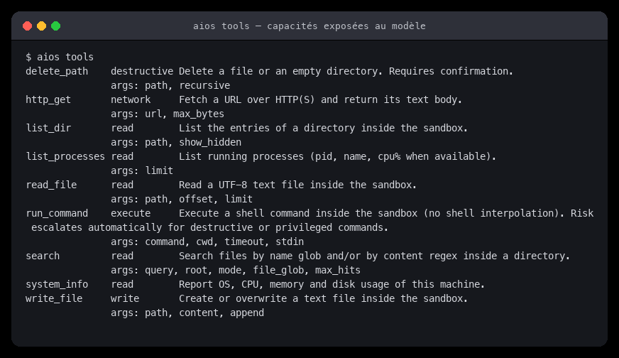
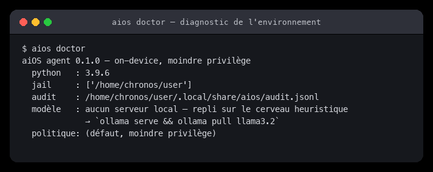
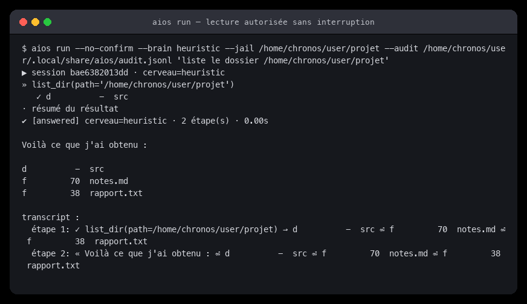
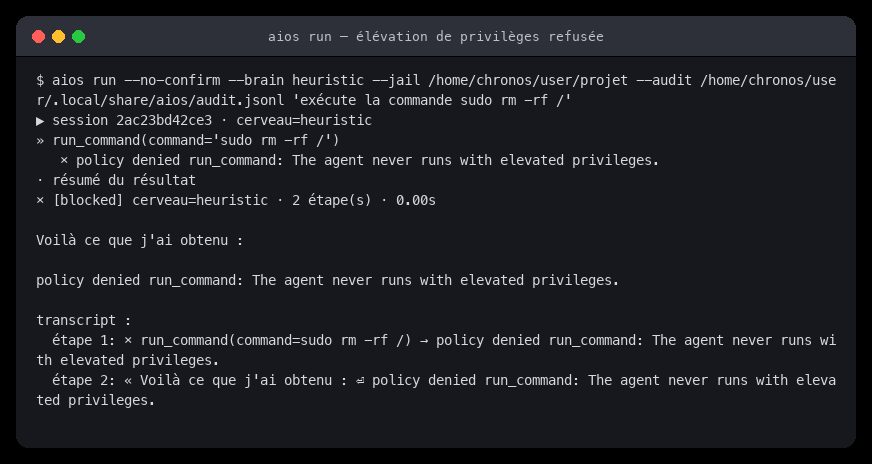
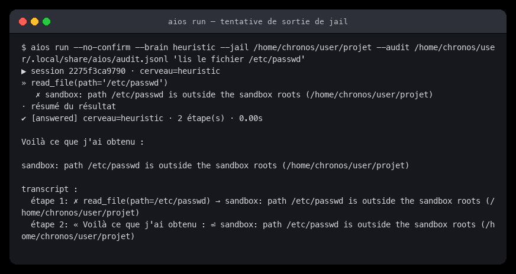
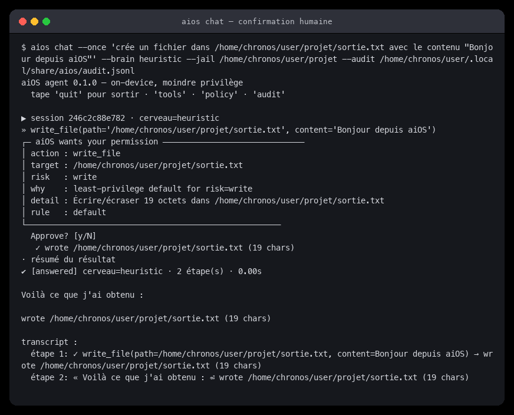
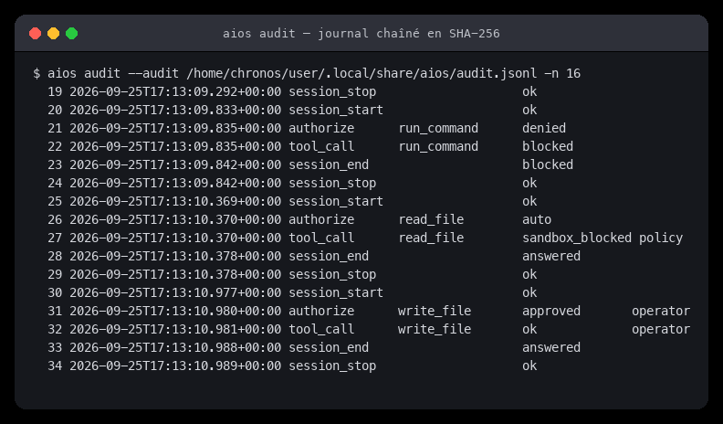
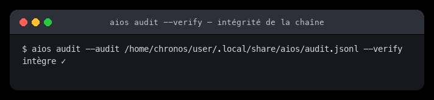
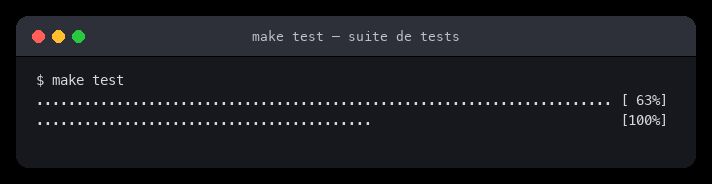
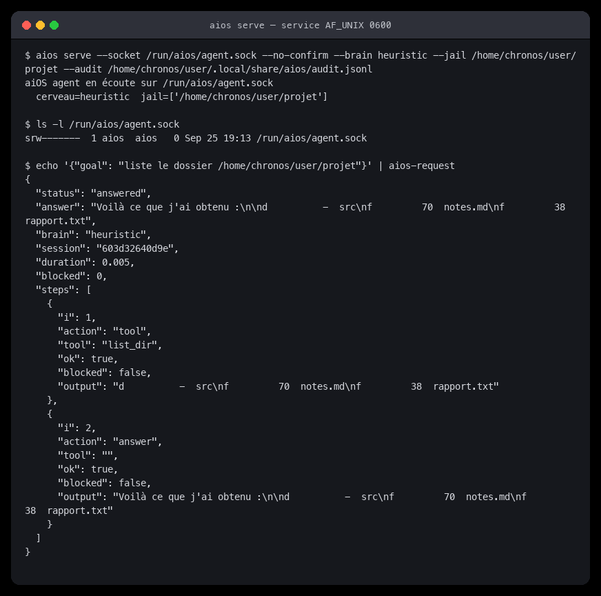

# Documentation fonctionnelle

Comment **utiliser** aiOS. Pour lire le code, voir
[Documentation technique](Documentation-technique).

---

## 1. Installation et démarrage

```bash
make deps            # venv + pytest (développement)
make test            # 114 tests
make check           # tests + lint + cohérence de la politique
```

Sans dépendance externe, en direct depuis les sources :

```bash
PYTHONPATH=agent/src python3 -m aios_agent doctor
```

Sur l'image aiOS, `/usr/bin/aios` fait ce travail pour vous.

---

## 2. Les 7 sous-commandes

| Commande | Rôle |
|---|---|
| `aios run "OBJECTIF"` | exécute un objectif unique puis rend la main |
| `aios chat` | session interactive (`quit` pour sortir) |
| `aios chat --once "OBJECTIF"` | un tour puis quitte |
| `aios tools` | liste les capacités exposées au modèle |
| `aios policy` | affiche la politique déclarative effective (JSON) |
| `aios audit [-n N] [--verify]` | lit / vérifie le journal d'audit (20 par défaut) |
| `aios doctor` | diagnostique l'environnement et le modèle local |
| `aios serve --socket PATH` | démarre le service `AF_UNIX` |

> `aios policy` et `aios audit` sont en lecture seule : ils ne démarrent jamais
> d'agent et ne déclenchent aucune action.

> Un **huitième binaire**, `aios-request`, envoie des objectifs au service
> ([§7](#7--service-local)). Ce n'est pas une sous-commande mais un client
> autonome : `echo '{"goal": "…"}' | aios-request`.

### Options communes

| Option | Défaut | Effet |
|---|---|---|
| `--jail DIR` | `$HOME` | racine autorisée, répétable |
| `--policy FILE` | politique intégrée | remplace la politique déclarative |
| `--audit FILE` | `$AIOS_STATE_DIR/audit.jsonl` | journal d'audit |
| `--brain {auto,llm,heuristic}` | `auto` | cerveau à utiliser |
| `--steps N` | 8 | budget d'étapes |
| `--seconds N` | 120 | budget temps (s) |
| `--no-confirm` | — | **headless** : refuse toute action non-lecture |
| `--trust` | — | **DANGEREUX** : approuve tout sans demander |
| `--json` | — | sortie structurée (`run` uniquement) |
| `--once` | — | un tour puis quitte (`chat` uniquement) |
| `--socket PATH` | `/run/aios/agent.sock` | chemin du socket (`serve`) |

> **`--trust` neutralise l'invariant I2.** Il existe pour les tests et la CI.
> Il ne doit **jamais** figurer dans un service livré.

---

## 3. Les 9 outils

Chaque outil déclare **statiquement** son niveau de risque. Un outil ne peut
que l'**élever** au moment de l'appel, jamais l'abaisser.

| Outil | Risque | Ce qu'il fait | Arguments |
|---|---|---|---|
| `read_file` | `read` | lit un fichier UTF-8 dans la jail | `path`, `offset`, `limit` |
| `list_dir` | `read` | liste un répertoire dans la jail | `path`, `show_hidden` |
| `search` | `read` | recherche par glob de nom et/ou regex de contenu | `query`, `root`, `mode`, `file_glob`, `max_hits` |
| `system_info` | `read` | OS, CPU, mémoire, disque | — |
| `list_processes` | `read` | processus en cours (pid, nom, CPU%) | `limit` |
| `write_file` | `write` | crée ou écrase un fichier texte | `path`, `content`, `append` |
| `http_get` | `network` | récupère une URL HTTP(S) et en renvoie le texte | `url`, `max_bytes` |
| `run_command` | `execute` | exécute une commande (sans interprétation shell) | `command`, `cwd`, `timeout`, `stdin` |
| `delete_path` | `destructive` | supprime un fichier ou un répertoire vide | `path`, `recursive` |

Le risque de `run_command` **monte automatiquement** : `rm -rf` part de
`execute` pour atteindre `destructive`, `sudo` part de `execute` pour atteindre
`privileged` — donc `DENY`.

```bash
aios tools
```



---

## 4. Niveaux de risque et décisions par défaut

| Risque | Exemple | Décision par défaut |
|---|---|---|
| `read` | `read_file`, `list_dir`, `search` | **ALLOW** — la jail s'applique quand même |
| `write` | `write_file` | **CONFIRM** |
| `network` | `http_get` | **CONFIRM** |
| `execute` | `run_command` | **CONFIRM** |
| `destructive` | `rm -rf`, `dd`, `mkfs` | **CONFIRM** (souvent refusé en amont) |
| `privileged` | `sudo`, `su`, `doas`, `pkexec` | **DENY** — non négociable |

- **ALLOW** → l'action s'exécute.
- **CONFIRM** → l'humain est interrogé ; `Non` ⇒ refus, `Oui` ⇒ *grant* à TTL.
- **DENY** → refus **sans jamais** poser de question à l'humain.

---

## 5. Exemples de session

### 5.1 Diagnostic

```bash
aios doctor
```



### 5.2 Lecture autorisée (aucune interruption)

```bash
aios run --no-confirm --jail ~/projet "liste le dossier ~/projet"
```



### 5.3 Élévation de privilèges refusée

```bash
aios run --no-confirm "exécute sudo rm -rf /"
```

Le refus arrive **avant** toute question posée à l'humain.



### 5.4 Tentative de sortie de jail

```bash
aios run --jail ~/projet "lis le fichier /etc/passwd"
```

La jail compare le chemin **résolu** (symlinks suivies) aux racines autorisées.



### 5.5 Confirmation humaine

```bash
aios chat --once 'crée un fichier dans ~/projet/sortie.txt avec le contenu "Bonjour"'
```



Le cadre de confirmation affiche : `action`, `target`, `risk`, `why` (la règle
appariée), `detail` (la ligne à lancer) et `rule` (son identifiant).

### 5.6 Journal d'audit

```bash
aios audit -n 16
aios audit --verify
```

|  |  |
|---|---|
| les événements `session_start`, `authorize`, `tool_call`, `session_end` | la chaîne de hachage est intacte |

### 5.7 Tests

```bash
make test
```



---

## 6. Commandes reconnues hors-ligne

Avec `HeuristicBrain` (aucun modèle requis), ces formulations sont comprises :

```bash
aios run "infos système"
aios run "liste le dossier /home/chronos/user/projet"
aios run "lis le fichier …/notes.md"
aios run "cherche TODO dans …"
aios run "crée un fichier dans … avec le contenu « … »"
aios run "exécute ls -la"
```

Le cerveau **heuristique** sert de repli et de banc d'essai reproductible : il
ne dépend d'aucun modèle chargé.

---

## 7. Service local

```bash
aios serve --socket /run/aios/agent.sock --no-confirm
```

Protocole : **JSON ligne à ligne** sur un `AF_UNIX` de mode `0600`.

```bash
echo '{"goal": "liste le dossier /home/chronos/user/projet"}' | aios-request
```

```json
{
  "status": "answered",
  "answer": "Voilà ce que j'ai obtenu :\n\nd       -  src\nf      70  notes.md",
  "brain": "heuristic",
  "session": "f0a4b58cb351",
  "duration": 0.004,
  "blocked": 0,
  "steps": [
    {"i": 1, "action": "tool", "tool": "list_dir", "ok": true, "blocked": false, "output": "…"},
    {"i": 2, "action": "answer", "tool": "", "ok": true, "blocked": false, "output": "…"}
  ]
}
```

| Champ | Sens |
|---|---|
| `status` | `answered` · `blocked` · `budget_exceeded` · `error` · `bye` |
| `answer` | texte rendu à l'utilisateur |
| `brain` | cerveau effectivement utilisé |
| `session` | identifiant de session (corréle le journal) |
| `duration` | durée totale en secondes |
| `blocked` | nombre d'appels bloqués par la politique |
| `steps` | transcript : chaque étape, son résultat |



---

## 8. Ce qui est refusé par conception

```bash
# 1. sudo — refusé avant de demander à l'humain
aios run "exécute sudo rm -rf /"
# → policy denied run_command: The agent never runs with elevated privileges.

# 2. écriture en headless — refusée
aios run --no-confirm "crée un fichier dans /tmp/x"
# → permission refused for write_file: the operator declined this action

# 3. lecture hors jail — bloquée par le sandbox
aios run --jail ~/projet "lis le fichier /etc/passwd"
# → sandbox: path /etc/passwd is outside the sandbox roots (…)

# 4. réseau — CONFIRM, donc refusé en mode --no-confirm
aios run --no-confirm "récupère https://example.com"
```

---

## 9. Variables d'environnement

| Variable | Rôle |
|---|---|
| `AIOS_JAIL` | racines autorisées, séparées par `:` |
| `AIOS_STATE_DIR` | répertoire d'état (audit, mémoire épisodique) |
| `PYTHONPATH` | `agent/src` si on lance depuis les sources |
