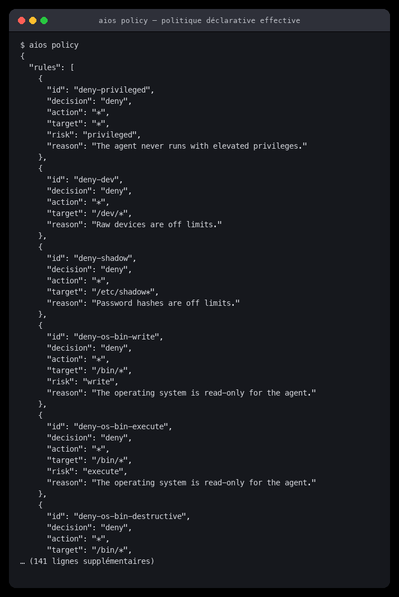

# aiOS

**Un OS basé sur Chromium OS, augmenté d'un assistant agentique 100 % local.**

aiOS assemble deux pièces indépendantes :

1. **La couche OS** — le code source de Chromium OS greffé du paquet
   `chromeos-base/aios-agent`, d'une politique de sécurité déclarative et d'un
   job upstart.
2. **Le moteur agentique** — un agent autonome (boucle *observe → décide → agit*)
   qui pilote des outils système **au nom de l'utilisateur**, sous un régime de
   **moindre privilège** où toute action non-lecture exige un humain.

> **Deux convictions de conception.** L'IA est **on-device** : aucun octet ne
> quitte la machine. Et la sécurité est **fail-closed** : ce qui n'est pas
> explicitement autorisé est refusé, et un refus ne sollicite jamais l'humain.

---

## Par où commencer

| Je veux… | Page |
|---|---|
| comprendre le périmètre et les arbitrages | [Vue d'ensemble](Vue-d-ensemble) |
| voir comment l'ensemble est câblé | [Architecture](Architecture) |
| utiliser l'agent (CLI, outils, commandes) | [Documentation fonctionnelle](Documentation-fonctionnelle) |
| lire le code (modules, formats, protocoles) | [Documentation technique](Documentation-technique) |
| visualiser le système (UML + Mermaid) | [Diagrammes UML](Diagrammes-UML) |
| relire la sécurité (invariants, limites) | [Modèle de sécurité](Modele-de-securite) |
| produire une image bootable | [Construction de l'OS](Construction-de-l-OS) |
| déployer et exploiter le service | [Déploiement et exploitation](Deploiement-et-exploitation) |
| dépanner | [FAQ](FAQ) |
| participer | [Contribuer](Contribuer) |

---

## Captures d'écran

Les captures ci-dessous sont **régénérées automatiquement** par
`python3 tools/make_screenshots.py` et **anonymisées** : le nom d'utilisateur,
le nom d'hôte et les chemins réels y sont remplacés par des identifiants de
démonstration (`aios`, `aios-devbox`, `/home/chronos/user/...`).

| | |
|---|---|
|  |  |
| `aios doctor` — diagnostic et détection du modèle local | `aios tools` — capacités exposées au modèle |
|  |  |
| `aios policy` — politique déclarative effective | lecture autorisée, sans interruption |
|  |  |
| élévation de privilèges refusée | tentative de lecture hors jail bloquée |
|  |  |
| confirmation humaine requise | journal d'audit chaîné en SHA-256 |
|  |  |
| vérification d'intégrité du journal | suite de tests |
|  | |
| service AF_UNIX 0600 + échange JSON ligne à ligne | |

---

## État du projet

- [x] Noyau agentique : boucle bornée, deux cerveaux, mémoire, 9 outils
- [x] Socle de sécurité : politique, permissions, sandbox, audit chaîné, masquage
- [x] Service local `AF_UNIX 0600` + CLI à 7 sous-commandes
- [x] Couche Chromium OS : ebuild, politique embarquée, job upstart, scripts de build
- [x] **114 tests**, `make check` vert, wiki + captures générées
- [ ] Intégration session : confirmation graphique via D-Bus dans Ash
- [ ] Outils supplémentaires : gestionnaire de paquets, réglages ChromeOS
- [ ] Profils de politique par rôle (enfant / admin / kiosque)

## Licence

BSD-3-Clause. Le code de Chromium OS reste sous sa propre licence.
