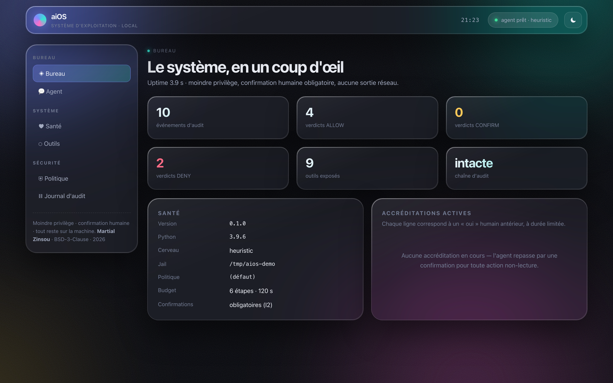
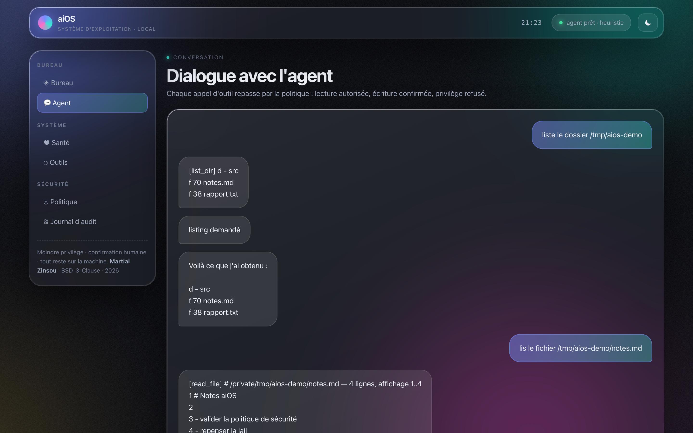
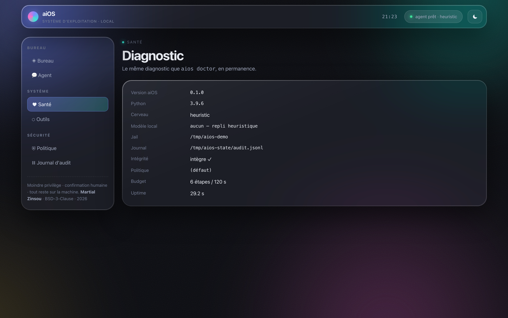
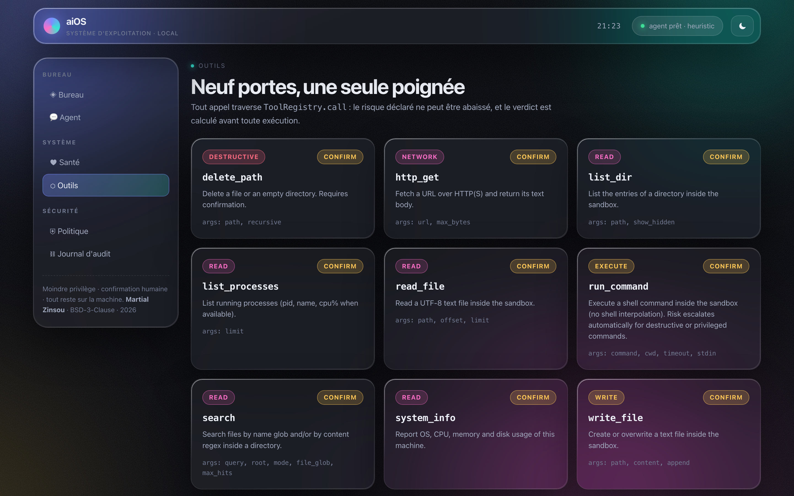
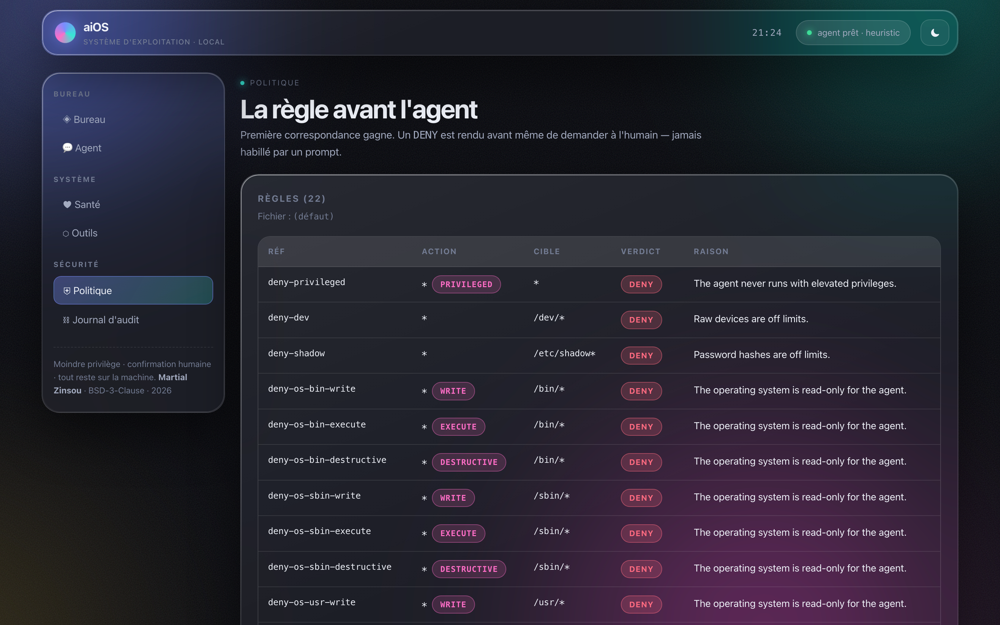
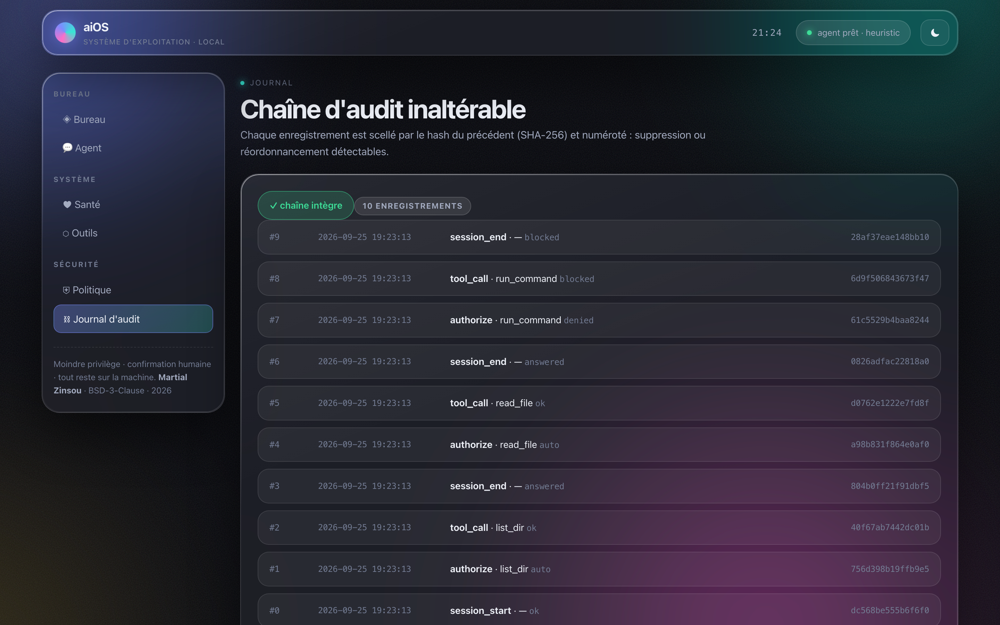
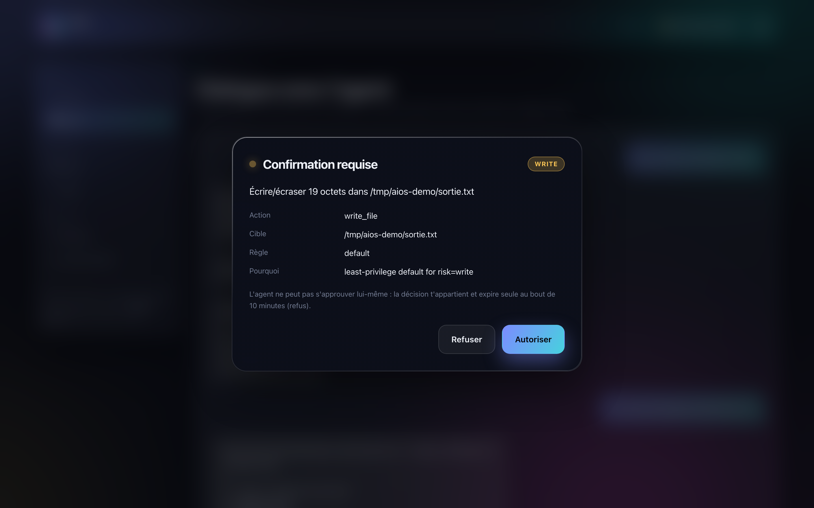

# Interface graphique

aiOS n'est pas qu'une ligne de commande : c'est un **système d'exploitation**
dont l'environnement principal est un **bureau en verre liquide** — panneaux de
verre dépoli, aurora animée, typographie SF Pro, thème clair/sombre. Cette
interface est servie **en local uniquement** par `aios ui`.

---

## 1. Démarrer le bureau

```bash
aios ui                       # ouvre le navigateur sur 127.0.0.1
aios ui --port 8765           # port fixe (0 = port aléatoire)
aios ui --no-browser          # affiche simplement l'URL
aios ui --trust               # DANGEREUX : plus aucune confirmation
```

Depuis les sources :

```bash
PYTHONPATH=agent/src python3 -m aios_agent ui --no-browser
```

Le processus affiche l'URL de session, qui contient le **jeton** :

```
aiOS console : http://127.0.0.1:49708/?t=cCY6SGcUpyM96q…
  cerveau=heuristic  jail=/home/chronos/user
```

> Le jeton n'est **jamais** écrit sur disque : il vit en mémoire côté serveur et
> côté `sessionStorage` du navigateur. L'URL est nettoyée dès le premier rendu.

---

## 2. Les six vues

| Vue | Route | Ce qu'on y voit |
|---|---|---|
| **Bureau** | `#/apercu` | compteurs d'audit, verdicts, santé, accréditations actives |
| **Agent** | `#/conversation` | dialogue, sorties d'outils, étapes de l'exécution |
| **Système** | `#/sante` | le diagnostic `aios doctor`, en continu |
| **Outils** | `#/outils` | les 9 outils, leur risque déclaré et leur verdict |
| **Politique** | `#/politique` | les 22 règles ordonnées, cible et raison |
| **Journal** | `#/journal` | la chaîne d'audit SHA-256, entrée par entrée |













---

## 3. La confirmation humaine, dans le navigateur

C'est le point le plus important : l'invariant **I2** (l'agent ne
s'approuve jamais lui-même) n'est pas abandonné parce que l'interface est
graphique.

1. l'agent demande une action non-lecture ;
2. le processus de l'interface **bloque** sur une file de confirmations ;
3. le bandeau apparaît avec l'action, la cible, la règle et la raison ;
4. l'humain tranche : **Autoriser** ou **Refuser** ;
5. au bout de 10 minutes sans décision, la demande expire sur **refus**
   (*fail-closed*).



L'agent n'a aucun accès à cette file : elle vit dans le processus du service,
pas dans l'espace de mémoire de la boucle d'exécution.

---

## 4. Sécurité de l'interface

| Contrôle | Détail |
|---|---|
| Liaison loopback | `127.0.0.1` uniquement — tout autre hôte est refusé au démarrage (`ValueError`) |
| Jeton de session | exigé sur **toutes** les routes `/api/*` (`X-AIOS-Token` ou `?t=`), comparaison en temps constant |
| Vérification du `Host` | tout `Host` hors `{127.0.0.1, localhost, ::1}` → `403` (relier-pour-noyer) |
| CSP stricte | `default-src 'self'`, `connect-src 'self'`, `base-uri 'none'`, `form-action 'none'` |
| Cache | `Cache-Control: no-store` sur HTML, JS, CSS et JSON |
| Fail-closed | confirmation non résolue avant le délai → **refus** |
| Sortie réseau | aucune requête sortante : l'interface ne parle qu'à elle-même |

Le service historique `aios serve` (socket `AF_UNIX 0600`, invariant **I11**)
reste le canal IPC de la session Chromium OS. L'interface HTTP loopback est un
**client supplémentaire**, pas son remplaçant : elle ne transporte ni les
objectifs du service ni son journal.

---

## 5. Régénérer les captures

```bash
python3 tools/make_ui_screenshots.py     # → wiki/captures/ui-0*.png
python3 tools/make_screenshots.py        # → wiki/captures/0*.png, 10-serve.png
```

Le script d'interface :

1. construit la même démo que les captures terminal (`/tmp/aios-demo`) ;
2. démarre un `UIServer` réel et pilote ses routes API ;
3. exécute trois objectifs (lecture autorisée, privilège refusé) puis un
   objectif d'écriture pour déclencher la confirmation ;
4. capture le rendu réel de **Chrome en mode headless** (1440×900 @2×) ;
5. applique `assert_anonymous` à l'état JSON que l'interface affiche.

Aucune capture n'est modifiée à la main.

---

> **Martial Zinsou** · BSD-3-Clause · 2026
